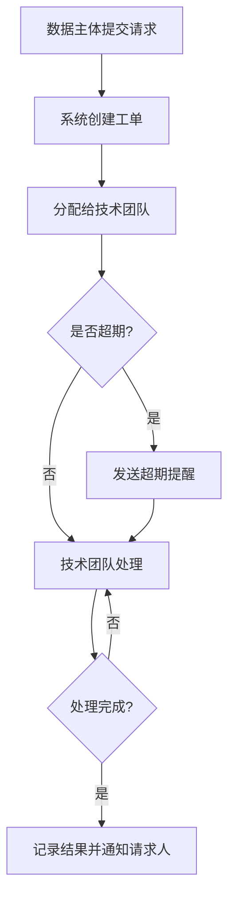
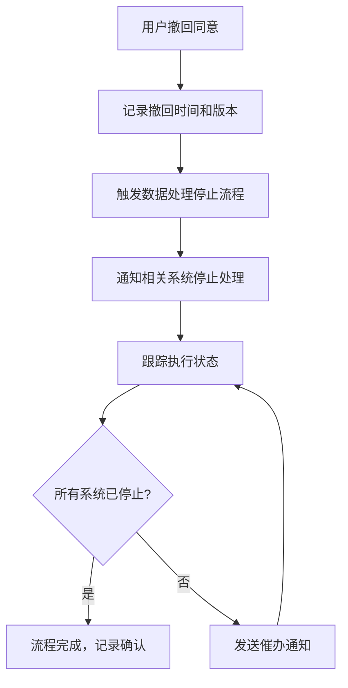
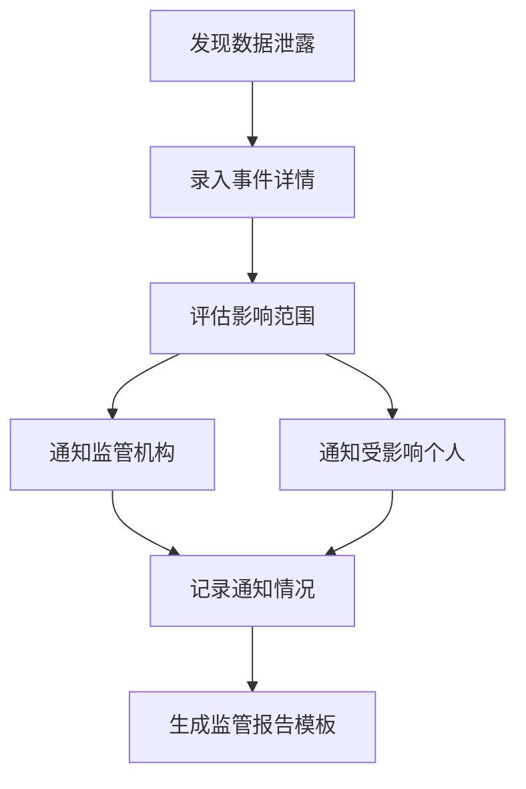

## 1. 产品概述

数据隐私合规管理工具（PrivacyGuard），帮助企业管理个人数据处理活动，满足 GDPR/个人信息保护法等法规要求。提供数据资产地图、同意管理、数据主体请求处理、泄露事件记录和合规审计等核心能力。

- 目标用户：企业隐私官（DPO）、法务合规团队、IT安全团队
- 核心价值：将分散的隐私合规工作集中化、流程化，降低违规风险和合规成本

## 2. 核心功能

### 2.1 用户角色

| 角色 | 注册方式 | 核心权限 |
|------|----------|----------|
| 隐私官（DPO） | 管理员分配 | 全部功能，含审计导出和监管报告 |
| 法务合规人员 | 管理员分配 | 数据资产管理、同意管理、请求处理、审计查看 |
| IT技术人员 | 管理员分配 | 数据主体请求处理、泄露事件技术响应 |
| 数据主体（外部） | 自助注册 | 提交访问/删除/导出请求，查看同意记录 |

### 2.2 功能模块

1. **仪表盘**：合规状态概览、关键指标卡片、待办事项、近期事件时间线
2. **数据资产地图**：各系统个人数据类型、处理目的、数据主体类型和保留期限管理
3. **同意记录管理**：同意版本追踪、时间记录、撤回触发处理停止流程
4. **数据主体请求**：工单创建与分配、处理进度追踪、响应时限与超期提醒
5. **数据泄露事件**：事件详情记录、影响范围评估、通知情况追踪、监管报告模板生成
6. **合规审计**：自动生成 RoPA，支持导出给监管机构或第三方审计

### 2.3 页面详情

| 页面名称 | 模块名称 | 功能描述 |
|----------|----------|----------|
| 仪表盘 | 合规评分卡片 | 显示整体合规评分和趋势 |
| 仪表盘 | 待办事项列表 | 展示待处理请求、即将到期任务 |
| 仪表盘 | 事件时间线 | 近期合规事件和状态变更 |
| 数据资产地图 | 系统数据录入 | 添加/编辑各系统处理的个人数据类型、处理目的、数据主体类型、保留期限 |
| 数据资产地图 | 数据资产总览表 | 以表格形式展示所有系统数据资产，支持筛选和搜索 |
| 数据资产地图 | 数据关系图谱 | 可视化展示系统间的数据流转关系 |
| 同意记录管理 | 同意版本管理 | 管理同意政策版本，记录生效时间 |
| 同意记录管理 | 同意记录列表 | 查看用户同意记录，含同意时间和版本 |
| 同意记录管理 | 撤回处理流程 | 同意撤回后自动触发数据处理停止流程，跟踪执行状态 |
| 数据主体请求 | 请求提交表单 | 数据主体提交访问/删除/导出请求 |
| 数据主体请求 | 工单管理面板 | 查看所有工单，按状态/类型筛选，分配给技术团队 |
| 数据主体请求 | 工单详情页 | 查看请求详情、处理进度、响应时限倒计时 |
| 数据泄露事件 | 事件录入表单 | 记录泄露事件详情、发现时间、影响范围 |
| 数据泄露事件 | 事件列表 | 查看所有泄露事件，按严重程度/状态筛选 |
| 数据泄露事件 | 通知追踪 | 记录监管机构和受影响个人通知情况 |
| 数据泄露事件 | 监管报告生成 | 自动生成合规监管报告模板 |
| 合规审计 | RoPA 自动生成 | 自动生成数据处理活动记录 |
| 合规审计 | 审计报告导出 | 支持 PDF/CSV 导出，供监管机构和第三方审计 |

## 3. 核心流程

### 数据主体请求处理流程

用户提交数据主体请求后，系统自动创建工单并分配给对应技术团队。技术团队在规定时限内处理请求，系统全程追踪进度并在即将超期时发出提醒。处理完成后记录结果并通知请求人。

### 同意撤回流程

用户撤回同意后，系统自动触发数据处理停止流程，通知相关系统停止该用户数据处理，并记录每一步执行状态。

### 数据泄露事件处理流程

发现数据泄露后，DPO 录入事件详情，评估影响范围，通知监管机构和受影响个人，生成监管报告。

## 4. 用户界面设计

### 4.1 设计风格

- **主色调**：深靛蓝（#1e3a5f）为主色，翠绿（#10b981）为强调色，传达安全感和合规信任
- **辅助色**：琥珀黄（#f59e0b）用于警告，玫瑰红（#ef4444）用于严重/紧急
- **按钮风格**：圆角矩形（rounded-lg），主按钮实色填充，次要按钮描边
- **字体**：标题使用 DM Sans（几何无衬线），正文使用 Source Sans 3
- **布局风格**：左侧固定导航栏 + 右侧内容区域，卡片式布局
- **图标风格**：Lucide 图标库，线性风格

### 4.2 页面设计概览

| 页面名称 | 模块名称 | UI 元素 |
|----------|----------|---------|
| 仪表盘 | 合规评分卡片 | 大号数字+环形进度条，深色卡片，翠绿强调色 |
| 仪表盘 | 待办事项列表 | 白色卡片列表，左侧色条标识优先级 |
| 仪表盘 | 事件时间线 | 垂直时间线，圆点节点，连接线 |
| 数据资产地图 | 数据录入表单 | 分步表单，卡片容器，字段分组 |
| 数据资产地图 | 总览表格 | 可排序表，行悬停高亮，行内操作按钮 |
| 同意记录管理 | 版本时间线 | 横向时间轴，版本节点，当前版本高亮 |
| 同意记录管理 | 撤回流程追踪 | 步骤进度条，状态标签，流转动画 |
| 数据主体请求 | 工单列表 | 看板视图（待处理/处理中/已完成），拖拽卡片 |
| 数据主体请求 | 时限倒计时 | 倒计时组件，接近到期变黄，超期变红闪烁 |
| 数据泄露事件 | 严重程度标识 | 红/橙/黄三级色标，事件卡片左侧色条 |
| 合规审计 | RoPA 预览 | 表格式预览，导出按钮，PDF/CSV 格式选择 |

### 4.3 响应式设计

桌面优先设计，左侧导航栏在移动端折叠为汉堡菜单，表格在小屏幕下使用卡片视图替代，工单看板在移动端切换为列表视图。
