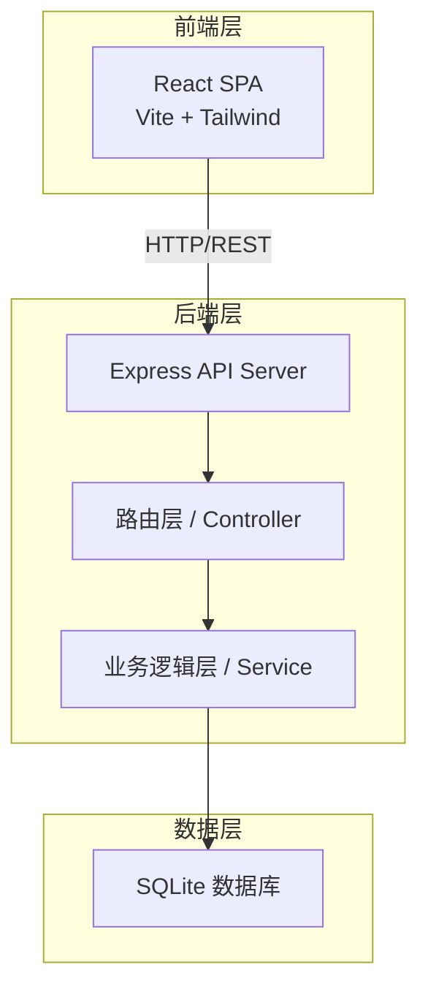
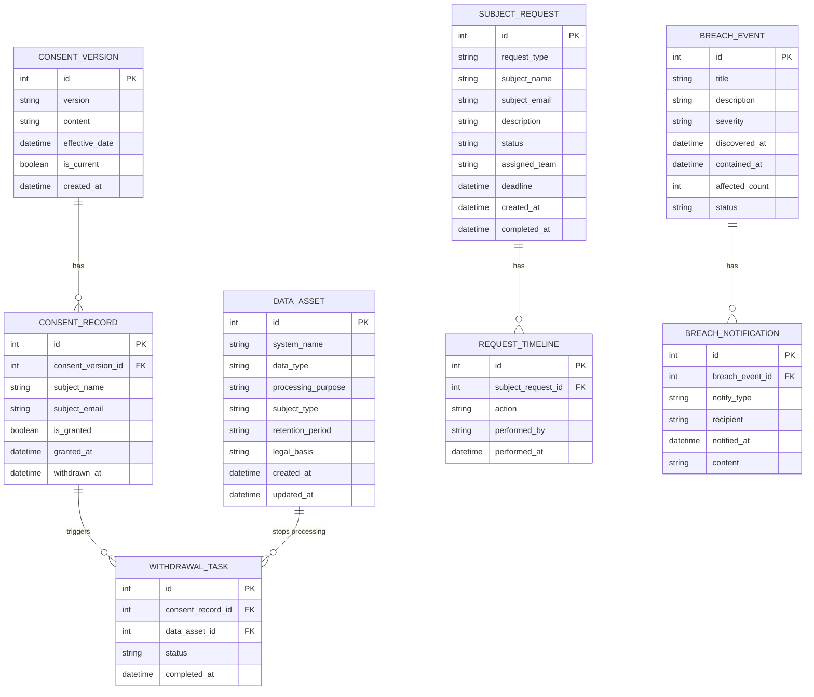

## 1. 架构设计



## 2. 技术说明

- **前端**：React@18 + TailwindCSS@3 + Vite + Zustand
- **初始化工具**：vite-init
- **后端**：Express@4 + TypeScript（ESM）
- **数据库**：SQLite（better-sqlite3），无需外部数据库服务
- **路由**：react-router-dom v6
- **图标**：lucide-react

## 3. 路由定义

| 路由 | 用途 |
|------|------|
| `/` | 仪表盘 - 合规状态概览 |
| `/data-assets` | 数据资产地图 - 系统数据管理 |
| `/consent` | 同意记录管理 - 同意版本和撤回 |
| `/requests` | 数据主体请求 - 工单管理 |
| `/breaches` | 数据泄露事件 - 事件记录与报告 |
| `/audit` | 合规审计 - RoPA 生成与导出 |

## 4. API 定义

### 4.1 数据资产 API

```
GET    /api/data-assets          获取所有数据资产
POST   /api/data-assets          创建数据资产
PUT    /api/data-assets/:id       更新数据资产
DELETE /api/data-assets/:id       删除数据资产
```

### 4.2 同意记录 API

```
GET    /api/consent-versions       获取同意版本列表
POST   /api/consent-versions       创建同意版本
GET    /api/consent-records        获取同意记录
POST   /api/consent-records        创建同意记录
POST   /api/consent-records/:id/withdraw  撤回同意
GET    /api/withdrawal-tasks       获取撤回处理任务
PUT    /api/withdrawal-tasks/:id   更新撤回任务状态
```

### 4.3 数据主体请求 API

```
GET    /api/subject-requests       获取请求列表
POST   /api/subject-requests       创建请求
PUT    /api/subject-requests/:id    更新请求
POST   /api/subject-requests/:id/assign  分配工单
GET    /api/subject-requests/:id/timeline 获取处理时间线
```

### 4.4 数据泄露事件 API

```
GET    /api/breaches               获取泄露事件列表
POST   /api/breaches               创建泄露事件
PUT    /api/breaches/:id           更新泄露事件
POST   /api/breaches/:id/notify    记录通知情况
GET    /api/breaches/:id/report    生成监管报告模板
```

### 4.5 合规审计 API

```
GET    /api/audit/ropa             生成 RoPA
GET    /api/audit/ropa/export     导出 RoPA（PDF/CSV）
GET    /api/audit/dashboard        获取审计仪表盘数据
```

## 5. 数据模型

### 5.1 数据模型定义



### 5.2 数据定义语言

```sql
CREATE TABLE data_assets (
  id INTEGER PRIMARY KEY AUTOINCREMENT,
  system_name TEXT NOT NULL,
  data_type TEXT NOT NULL,
  processing_purpose TEXT NOT NULL,
  subject_type TEXT NOT NULL CHECK(subject_type IN ('用户', '员工', '合作方')),
  retention_period TEXT NOT NULL,
  legal_basis TEXT NOT NULL,
  created_at DATETIME DEFAULT CURRENT_TIMESTAMP,
  updated_at DATETIME DEFAULT CURRENT_TIMESTAMP
);

CREATE TABLE consent_versions (
  id INTEGER PRIMARY KEY AUTOINCREMENT,
  version TEXT NOT NULL,
  content TEXT NOT NULL,
  effective_date DATETIME NOT NULL,
  is_current BOOLEAN DEFAULT 0,
  created_at DATETIME DEFAULT CURRENT_TIMESTAMP
);

CREATE TABLE consent_records (
  id INTEGER PRIMARY KEY AUTOINCREMENT,
  consent_version_id INTEGER NOT NULL REFERENCES consent_versions(id),
  subject_name TEXT NOT NULL,
  subject_email TEXT NOT NULL,
  is_granted BOOLEAN DEFAULT 1,
  granted_at DATETIME DEFAULT CURRENT_TIMESTAMP,
  withdrawn_at DATETIME
);

CREATE TABLE withdrawal_tasks (
  id INTEGER PRIMARY KEY AUTOINCREMENT,
  consent_record_id INTEGER NOT NULL REFERENCES consent_records(id),
  data_asset_id INTEGER NOT NULL REFERENCES data_assets(id),
  status TEXT NOT NULL DEFAULT 'pending' CHECK(status IN ('pending', 'processing', 'completed')),
  completed_at DATETIME
);

CREATE TABLE subject_requests (
  id INTEGER PRIMARY KEY AUTOINCREMENT,
  request_type TEXT NOT NULL CHECK(request_type IN ('access', 'deletion', 'export')),
  subject_name TEXT NOT NULL,
  subject_email TEXT NOT NULL,
  description TEXT,
  status TEXT NOT NULL DEFAULT 'pending' CHECK(status IN ('pending', 'assigned', 'processing', 'completed', 'overdue')),
  assigned_team TEXT,
  deadline DATETIME NOT NULL,
  created_at DATETIME DEFAULT CURRENT_TIMESTAMP,
  completed_at DATETIME
);

CREATE TABLE request_timeline (
  id INTEGER PRIMARY KEY AUTOINCREMENT,
  subject_request_id INTEGER NOT NULL REFERENCES subject_requests(id),
  action TEXT NOT NULL,
  performed_by TEXT NOT NULL,
  performed_at DATETIME DEFAULT CURRENT_TIMESTAMP
);

CREATE TABLE breach_events (
  id INTEGER PRIMARY KEY AUTOINCREMENT,
  title TEXT NOT NULL,
  description TEXT NOT NULL,
  severity TEXT NOT NULL CHECK(severity IN ('low', 'medium', 'high', 'critical')),
  discovered_at DATETIME NOT NULL,
  contained_at DATETIME,
  affected_count INTEGER DEFAULT 0,
  status TEXT NOT NULL DEFAULT 'investigating' CHECK(status IN ('investigating', 'contained', 'resolved')),
  created_at DATETIME DEFAULT CURRENT_TIMESTAMP
);

CREATE TABLE breach_notifications (
  id INTEGER PRIMARY KEY AUTOINCREMENT,
  breach_event_id INTEGER NOT NULL REFERENCES breach_events(id),
  notify_type TEXT NOT NULL CHECK(notify_type IN ('regulator', 'affected_persons', 'internal')),
  recipient TEXT NOT NULL,
  notified_at DATETIME,
  content TEXT
);
```
